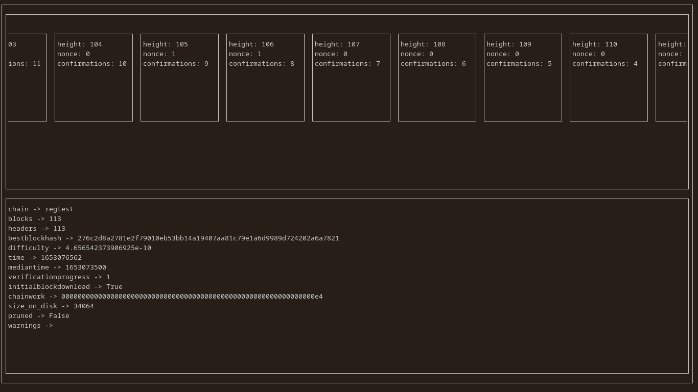

# bitui

A terminal user interface for a Bitcoin Core node. Currently, just a proof of
concept and a work in progress.

# to do

- [ ] tests
- [ ] tox
- [ ] docker
- [x] pre-commit-config.yaml
- [ ] implement call cache
- [ ] implement dynamic terminal size
- [ ] implement async code
- [ ] remove `requests` dependency
